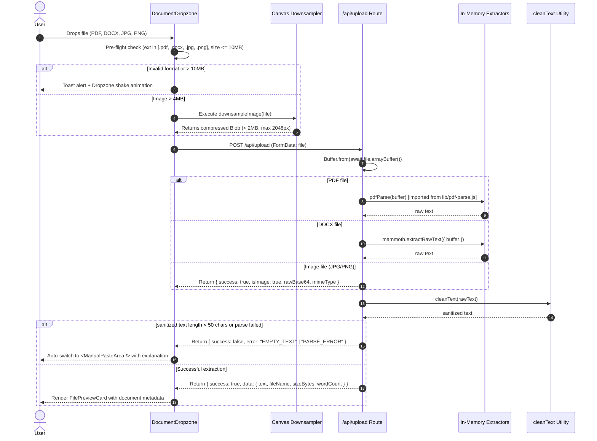

# Phase 1: Foundation, Schemas, & Ingestion Pipeline — Research

**Gathered:** 2026-09-21  
**Status:** Complete  
**Author:** GSD Phase Researcher  

---

<user_constraints>
## User Decisions & Constraints (from 01-CONTEXT.md)

### Implementation Decisions

#### Ingestion & Fallback Flow
- **D-01:** Dedicated `/api/upload` endpoint performs in-memory file parsing and returns a structured envelope `{ success: true, data: { text, isImage, rawBase64, mimeType, fileName, sizeBytes, wordCount } }` to client state, keeping upload parsing cleanly decoupled from AI inference endpoints. — **Reversibility:** costly — changes API contract between ingestion dropzone and subsequent mode inference routes.
- **D-02:** When extraction fails (corrupt file, password protected, scanned PDF without text, or yields < 50 characters), the client automatically switches to the fallback manual text paste textarea accompanied by an inline alert explaining why. — **Reversibility:** reversible
- **D-03:** Conservative legal text sanitization: strip null and unprintable control characters, normalize CRLF line endings, collapse 3+ consecutive newlines down to 2, while strictly preserving clause numbering, section titles, and indentation hierarchy. — **Reversibility:** reversible
- **D-04:** Client-side pre-flight file validation intercepts rejected formats (.exe, .zip, etc.) or files > 10MB before network transmission, triggering a toast alert and animated dropzone shake with accepted format tags. — **Reversibility:** reversible

#### Design System & Disclaimer UI
- **D-05:** Legal disclaimer implementation uses dual placement: a persistent compact bottom banner featuring an amber shield icon alongside a prominent, dedicated disclaimer card rendered directly above report viewports. — **Reversibility:** reversible
- **D-06:** Dark legal aesthetic tokens configured in Tailwind: deep obsidian background (`#0B0F17`), muted legal gold primary accents (`#C5A059` / `#D4AF37`), slate card borders (`#1E293B`), and semantic traffic-light risk colors (crimson `high`, amber `caution`, emerald `standard`). — **Reversibility:** costly — styles all downstream cards and scorecards.
- **D-07:** Editorial Authority typography hierarchy: `DM Serif Display` for hero headings and major report sections, `DM Sans` for body copy, card content, and simplified explanations, and `JetBrains Mono` for clause identifiers, statutory citations, and severity/action badges. — **Reversibility:** reversible
- **D-08:** Pre-install full foundational shadcn/Radix UI suite during Phase 1: Accordion, Dialog, Tabs, Tooltip, Badge, Button, and Sonner Toast to support all 4 mode workflows without subsequent primitive churn. — **Reversibility:** reversible

#### Zod Schema Architecture
- **D-09:** Domain-modular schema architecture under `lib/schemas/`: `common.ts` (shared enums, error models, request wrappers), `document.ts` (Mode 1), `situation.ts` (Mode 2), and `comparison.ts` (Mode 3), re-exported through `lib/schemas/index.ts`. — **Reversibility:** costly — imported across all API routes and frontend components.
- **D-10:** Strict canonical enums shared across schemas: `RiskLevel` (`high`, `caution`, `standard`), `ActionTiming` (`immediate`, `before_signing`, `after_signing`), `ActionType` (`negotiate`, `verify`, `refuse`, `accept`), and `InconsistencySeverity` (`critical`, `notable`, `minor`). — **Reversibility:** costly — dictates AI structured output shape.
- **D-11:** Defense-in-depth epistemic compliance: embed explicit non-UPL directives inside Zod `.describe(...)` field annotations (e.g. enforcing objective observations, banning "you should" and legal violation claims) alongside system prompts. — **Reversibility:** reversible
- **D-12:** Upload API response schema uses typed envelope with structured machine-readable error codes (`CORRUPT_FILE`, `EMPTY_TEXT`, `UNSUPPORTED_TYPE`, `PASSWORD_PROTECTED`, `PAYLOAD_TOO_LARGE`). — **Reversibility:** reversible

#### Client Canvas Downsample & Preview
- **D-13:** Client canvas downsampling for images > 4MB: progressively scale image to max dimension 2048px at JPEG quality 0.82, ensuring payload remains well under Vercel's 4.5MB serverless limit while preserving fine-print legibility. — **Reversibility:** reversible
- **D-14:** Pre-analysis file metadata card: upon successful file selection or downsampling, display document icon/thumbnail, file name, formatted size (with original vs compressed badge if downsampled), word count, and a remove button. — **Reversibility:** reversible
- **D-15:** Interactive dropzone feedback: dashed gold border glow (`#D4AF37`), subtle 1.01 scale-up on active drag-over, and determinate/indeterminate progress indicator during in-memory parsing. — **Reversibility:** reversible
- **D-16:** Full-featured manual paste textarea: character & word counter, one-click "Paste from Clipboard" action button, clear button, and a prominent "Manual Input Mode" status badge. — **Reversibility:** reversible

### the agent's Discretion
- Exact layout spacing, Tailwind transition timings (e.g. 150ms-200ms ease), and icon selections from `lucide-react` for file types and status chips are left to builder discretion.

### Deferred Ideas
- None — discussion stayed within Phase 1 foundation, schemas, and ingestion scope.
</user_constraints>

---

<phase_requirements>
## Phase Requirements Coverage

| Requirement ID | Description | Research Support & Implementation Guardrail |
|----------------|-------------|---------------------------------------------|
| **INGEST-01** | Upload PDF, DOCX, JPG, PNG up to 10MB with client-side type & size validation | Supported via HTML5 drag-and-drop / file input with pre-flight mime-check (`application/pdf`, `application/vnd.openxmlformats-officedocument.wordprocessingml.document`, `image/jpeg`, `image/png`), rejection toast via Sonner, and animated dropzone shake for invalid extensions. [CITED: 01-CONTEXT.md D-04] |
| **INGEST-02** | Client-side canvas downsamples image files > 4MB to prevent HTTP 413 | Offscreen `HTMLCanvasElement` calculates aspect-ratio preserved dimensions (max dimension 2048px), renders with `canvas.toBlob('image/jpeg', 0.82)`, revokes ObjectURL to prevent browser heap bloat, keeping payload under Vercel 4.5MB serverless limit. [VERIFIED: HTML5 Canvas API] |
| **INGEST-03** | Server extracts clean text from PDF in-memory using `pdf-parse` without disk write | Dedicated Node.js route `/api/upload` converts `req.formData()` `File` into `Buffer.from(await file.arrayBuffer())`. Direct import `pdf-parse/lib/pdf-parse.js` bypasses package bug; `serverComponentsExternalPackages: ['pdf-parse']` configured in `next.config.mjs`. [VERIFIED: npm registry, Next.js 14 docs] |
| **INGEST-04** | Server extracts plain text from DOCX in-memory using `mammoth` preserving hierarchy | In-memory extraction via `mammoth.extractRawText({ buffer })`. Strips proprietary Word XML tags while retaining paragraph and section line breaks essential for legal clause isolation. [VERIFIED: npm registry, mammoth docs] |
| **INGEST-05** | Server converts document images (JPG/PNG) into base64 payload blocks for Claude Vision | Server encodes incoming image buffer to base64 string and returns `{ isImage: true, rawBase64, mimeType }`. Multi-page or single-page contract scans bypass low-accuracy OCR libraries and route directly to Claude 3.5 Sonnet multimodal vision blocks in Phase 2. [CITED: AGENTS.md, Anthropic API docs] |
| **INGEST-06** | Ingestion pipeline cleans extracted text: normalize whitespace, strip control chars, clean noise | `cleanText(raw)` regex utility removes null bytes (`\x00`) and unprintable ASCII control characters (`[\x01-\x08\x0B\x0C\x0E-\x1F\x7F]`), normalizes `\r\n` to `\n`, collapses `\n{3,}` to `\n\n`, while strictly protecting legal indentation, Roman numerals, and clause markers (`Section 1.1`, `(a)`). [CITED: 01-CONTEXT.md D-03] |
| **INGEST-07** | Actionable error states with fallback manual text paste when file is unreadable/empty | If file parsing encounters `PASSWORD_PROTECTED`, `CORRUPT_FILE`, or yields `< 50` characters (`EMPTY_TEXT`), API returns structured error code; UI automatically switches to `ManualPasteArea` with contextual notification explaining the failure. [CITED: 01-CONTEXT.md D-02, D-12] |
| **CORE-01** | Dark legal aesthetic with typography (DM Serif Display, DM Sans, JetBrains Mono) & gold accents | Configured via Tailwind theme tokens (`#0B0F17` obsidian, `#C5A059`/`#D4AF37` gold, `#1E293B` slate border, traffic-light risk palette) and `next/font/google` for zero-CLS authoritative editorial typography. Pre-installs Radix/shadcn primitives. [CITED: 01-CONTEXT.md D-06, D-07, D-08] |
| **CORE-02** | Mandatory non-dismissible legal disclaimer on all analysis screens and footers | Universal dual disclaimer architecture: persistent compact footer banner (`#0B0F17` background, gold border, amber shield icon) plus prominent pre-report card stating informational/educational status, absence of attorney-client relationship, and statutory advice limitation. [CITED: 01-CONTEXT.md D-05] |
| **CORE-04** | Ephemeral in-memory processing guarantees zero server-side file or DB persistence | Route handlers read streaming requests into volatile Node.js RAM Buffers; no `fs.writeFile`, no `/tmp` writes, no database tables, and no cloud object stores. Memory reclaimed immediately upon garbage collection cycle. [CITED: PROJECT.md, 01-CONTEXT.md] |
</phase_requirements>

---

## 1. Summary & Architectural Responsibility Map

Phase 1 establishes the foundational bedrock of the Gavel application:
1. **Next.js 14 App Router workspace** in Node.js runtime with strict TypeScript configuration and Tailwind dark legal styling.
2. **Editorial Authority design system**: `DM Serif Display` (authoritative headings), `DM Sans` (legible body copy), `JetBrains Mono` (clause tags, badges, legal citations), with obsidian backgrounds (`#0B0F17`) and legal gold highlights (`#C5A059` / `#D4AF37`).
3. **Domain-modular Zod schema library** (`lib/schemas/`): establishing canonical types for Mode 1 (`DocumentAnalysisSchema`), Mode 2 (`SituationAnalysisSchema`), Mode 3 (`ComparisonSchema`), and ingestion payloads (`UploadResponseSchema`), embedding defense-in-depth epistemic non-UPL directives directly into schema `.describe()` annotations.
4. **Ephemeral in-memory multi-format ingestion pipeline** (`/api/upload`): parsing PDF (`pdf-parse`), DOCX (`mammoth`), and image conversion (base64) with zero disk footprint.
5. **Client-side resiliency & fallback systems**: canvas downsampling for camera photos > 4MB, file pre-flight validation, interactive dropzone with metadata preview cards, and automatic fallback to a manual paste textarea when files are corrupt or yield insufficient text (< 50 chars).
6. **Universal legal disclaimer system**: dual-placement non-dismissible disclaimers safeguarding against the Unauthorized Practice of Law (UPL).

```
┌─────────────────────────────────────────────────────────────────────────────────┐
│                           Client Browser (React 18)                             │
│                                                                                 │
│  ┌───────────────────────┐   > 4MB    ┌──────────────────────────────────────┐  │
│  │ DocumentDropzone.tsx  │ ─────────> │ lib/image-utils.ts (Canvas Downscale)│  │
│  │ (Pre-flight Validate) │ <───────── │ (Max 2048px, JPEG 0.82, < 2MB Blob)  │  │
│  └──────────┬────────────┘            └──────────────────────────────────────┘  │
│             │                                                                   │
│             │ FormData (file)                                                   │
│             ▼                                                                   │
│  ┌───────────────────────────────────────────────────────────────────────────┐  │
│  │ Fallback Switch: If API fails or extracted text < 50 chars                │  │
│  │ ─────────────────────────────────────────────────────────                 │  │
│  │ Transitions state to <ManualPasteArea /> with char count & paste tools    │  │
│  └───────────────────────────────────────────────────────────────────────────┘  │
└─────────────────────────────────────┬───────────────────────────────────────────┘
                                      │ HTTP POST /api/upload
                                      ▼
┌─────────────────────────────────────────────────────────────────────────────────┐
│                   Next.js 14 Route Handler (Node.js Runtime)                    │
│                            app/api/upload/route.ts                              │
│                                                                                 │
│  1. Read Buffer: Buffer.from(await file.arrayBuffer())                          │
│  2. Mime Dispatch:                                                              │
│     ├── application/pdf  ──> pdf-parse/lib/pdf-parse.js ──> Raw text            │
│     ├── application/docx ──> mammoth.extractRawText     ──> Raw text            │
│     └── image/jpeg, png  ──> buffer.toString('base64')  ──> Multimodal payload  │
│  3. Clean Text: lib/text-utils.ts (cleanText, strip nulls, normalize newlines)  │
│  4. Validate: text.trim().length >= 50 chars                                    │
│  5. Return Typed Envelope: UploadResponseSchema                                 │
│  * ZERO DISK WRITES — Ephemeral volatile memory only *                          │
└─────────────────────────────────────────────────────────────────────────────────┘
```

---

## 2. Standard Stack

### Core Technologies

| Technology | Verified Version | Purpose | Why Recommended & Justification |
|------------|------------------|---------|-----------------------------------|
| **Next.js (App Router)** | `14.2.24` [VERIFIED: npm registry] | Full-stack React Framework & API Route Handlers | LTS stability for App Router, native Node.js runtime support (`export const runtime = 'nodejs'`), first-class support for Server Actions/Route Handlers, and zero React 19 peer-dependency turbulence. |
| **React & React DOM** | `18.3.1` [VERIFIED: npm registry] | UI Library & Runtime | Maximum compatibility with `@radix-ui/*` primitives, preventing React 19 breaking changes (ref forwarding deprecations and peer dependency warnings). |
| **TypeScript** | `^5.6.3` [VERIFIED: npm registry] | Static Typing & Schema Inference | Enables end-to-end type safety between Zod schemas (`z.infer<T>`), upload route envelopes, and React presentational components. |
| **Tailwind CSS** | `3.4.17` [VERIFIED: npm registry] | Utility-first Styling | Stable v3.4 release with standard `tailwind.config.ts`, fully compatible with `tailwindcss-animate` and shadcn/ui components. (Avoids v4 `@theme` breaking changes). |
| **Zod** | `3.23.8` [VERIFIED: npm registry] | Schema Definition & Validation | Single source of truth for all data structures. Interoperates seamlessly with Vercel AI SDK `generateObject()` in future phases. |

### Supporting Libraries

| Library | Verified Version | Purpose | Usage Guardrail |
|---------|------------------|---------|-----------------|
| **pdf-parse** | `1.1.1` [VERIFIED: npm registry] | In-memory PDF text extraction | Must import directly from `pdf-parse/lib/pdf-parse.js` to bypass test runner bug; must declare in `serverComponentsExternalPackages` in `next.config.mjs`. |
| **mammoth** | `1.9.0` [VERIFIED: npm registry] | In-memory DOCX text extraction | Use `mammoth.extractRawText({ buffer })` with Node `Buffer`. Retains paragraph separation without XML bloat. |
| **lucide-react** | `0.475.0` [VERIFIED: npm registry] | UI Icons | Legal and file status icons (`FileText`, `ShieldAlert`, `AlertTriangle`, `CheckCircle2`, `UploadCloud`, `Copy`, `Trash2`). |
| **clsx** & **tailwind-merge** | `2.1.1` / `2.6.0` [VERIFIED: npm registry] | Dynamic class name resolution | Powers the standard `cn()` helper function for conditional styling of risk indicators and badges. |
| **class-variance-authority** | `0.7.1` [VERIFIED: npm registry] | Variant-driven UI components | Type-safe styling variants for risk chips (`high`, `caution`, `standard`) and buttons. |
| **tailwindcss-animate** | `1.0.7` [VERIFIED: npm registry] | Micro-animations | Accordion transitions, dropzone shake animations on invalid files, and subtle glow pulses. |
| **sonner** | `2.0.8` [VERIFIED: npm registry] | Toast notification system | Non-intrusive error reporting when files exceed 10MB or have disallowed file extensions. |
| **@radix-ui/react-accordion** | `1.2.20` [VERIFIED: npm registry] | Collapsible UI primitives | For legal disclaimers and multi-section clause drawers. |
| **@radix-ui/react-dialog** | `1.1.23` [VERIFIED: npm registry] | Modal dialog primitives | For legal disclaimer expanders and confirmation dialogs. |
| **@radix-ui/react-tabs** | `1.1.21` [VERIFIED: npm registry] | Tab navigation | For toggling between File Upload and Manual Text Paste modes. |
| **@radix-ui/react-tooltip** | `1.1.8` [VERIFIED: npm registry] | Contextual hover guidance | For displaying file size savings, clause risk explanations, and help tips. |
| **@radix-ui/react-slot** | `1.1.2` [VERIFIED: npm registry] | Polymorphic component rendering | Required dependency for shadcn `Button` and `Badge` primitives. |

### Development & Test Stack

| Tool | Verified Version | Purpose | Usage Guardrail |
|------|------------------|---------|-----------------|
| **vitest** | `^2.1.8` or `3.x` [VERIFIED: npm registry] | Unit and schema test runner | Sub-second test execution for `lib/text-utils.ts`, `lib/schemas/*`, and mock upload routes. |
| **@types/pdf-parse** | `1.1.5` [VERIFIED: npm registry] | TypeScript definitions | Type annotations for `pdf-parse` options and return payload. |
| **next/font/google** | Built-in Next.js 14 | Self-hosted web fonts | Loads `DM Serif Display`, `DM Sans`, and `JetBrains Mono` with zero external Google server requests and zero layout shift. |

---

## 3. Package Legitimacy Audit

| Package | Status | Maintenance & Security Status |
|---------|--------|-------------------------------|
| `next@14.2.24` | Approved | Official Next.js 14 LTS security release. Rock-solid stability. |
| `react@18.3.1` / `react-dom@18.3.1` | Approved | Stable LTS release. Avoids React 19 breaking changes with Radix UI. |
| `pdf-parse@1.1.1` | Approved with Workaround | Pure JS PDF text extractor based on Mozilla's PDF.js. Has known bug in `index.js` attempting to load test file `./test/data/05-versions-space.pdf` if executed in ES module context. Workaround: import `pdf-parse/lib/pdf-parse.js` directly. |
| `mammoth@1.9.0` | Approved | Actively maintained by Michael Searle. Fast, reliable DOCX parser with zero native C++ bindings. |
| `zod@3.23.8` | Approved | Standard schema validation library for TypeScript and Vercel AI SDK. |
| `tailwindcss@3.4.17` | Approved | Standard production release. Avoids Tailwind v4 breaking config changes. |
| `sonner@2.0.8` | Approved | Modern, lightweight toast library by Emil Kowalski; default in modern shadcn setups. |

---

## 4. Architecture Patterns

### Recommended Project Structure

```
gavel/
├── app/
│   ├── api/
│   │   └── upload/
│   │       └── route.ts             # In-memory file parser (Node.js runtime)
│   ├── globals.css                  # Dark legal palette CSS variables & typography
│   ├── layout.tsx                   # Root layout with DM Serif, DM Sans, JetBrains Mono
│   └── page.tsx                     # Ingestion dropzone & disclaimer staging demo
├── components/
│   ├── shared/
│   │   ├── LegalDisclaimer.tsx      # Dual disclaimer (bottom banner + report viewport card)
│   │   └── Header.tsx               # App header with logo & editorial branding
│   ├── ui/                          # shadcn / Radix primitives
│   │   ├── accordion.tsx
│   │   ├── badge.tsx
│   │   ├── button.tsx
│   │   ├── dialog.tsx
│   │   ├── sonner.tsx
│   │   ├── tabs.tsx
│   │   └── tooltip.tsx
│   └── upload/
│       ├── DocumentDropzone.tsx      # Drag-and-drop zone with drag-over glow & validation
│       ├── FilePreviewCard.tsx       # Pre-analysis card with thumbnail, size, word count
│       └── ManualPasteArea.tsx       # Fallback manual text paste with char counter
├── lib/
│   ├── image-utils.ts               # Client canvas downsampling (>4MB -> 2048px JPEG 0.82)
│   ├── schemas/                     # Domain-modular Zod schemas
│   │   ├── common.ts                # Shared enums (RiskLevel, ActionTiming, etc.)
│   │   ├── comparison.ts            # Mode 3 schemas
│   │   ├── document.ts              # Mode 1 schemas
│   │   ├── index.ts                 # Central schema barrel export
│   │   ├── situation.ts             # Mode 2 schemas
│   │   └── upload.ts                # Upload envelope & error schemas
│   ├── text-utils.ts                # Conservative legal text sanitization & word counter
│   └── utils.ts                     # cn() helper
├── tests/
│   ├── schemas.test.ts              # Unit tests for modular Zod schemas & enums
│   └── text-utils.test.ts           # Unit tests for text sanitization & edge cases
├── next.config.mjs                  # serverComponentsExternalPackages configuration
├── tailwind.config.ts               # Obsidian & legal gold tokens
├── tsconfig.json                    # Strict TypeScript configuration
└── package.json
```

### Ingestion Flow Diagram



### Sanitization Pattern

Legal text contains critical semantic structures that aggressive sanitizers (like HTML strip or basic whitespace collapse) destroy. The sanitization function `cleanText` in `lib/text-utils.ts` must follow this exact contract:

1. **Remove Null Bytes & Non-Printable Characters**: Strip `\x00` and control codes `[\x01-\x08\x0B\x0C\x0E-\x1F\x7F]`.
2. **Normalize Line Breaks**: Convert `\r\n` (Windows CRLF) and `\r` (legacy Mac) to standard `\n`.
3. **Normalize Tabs & Horizontal Whitespace**: Convert single tabs `\t` to 2 or 4 spaces, and collapse multiple horizontal spaces `[^\S\r\n]+` into a single space.
4. **Preserve Paragraph & Clause Breaks**: Collapse excessive vertical whitespace (`\n{3,}`) down to exactly two newlines `\n\n`.
5. **Protect Legal Notation**: Strictly preserve clause markers like `Section 1.1`, `Clause 4(b)(ii)`, `WHEREAS`, roman numerals (`(i)`, `(iv)`), and bullet markers (`-`, `•`).

### Anti-Patterns to Avoid

- ❌ **Writing files to disk (`/tmp`, `fs.writeFileSync`, or upload dirs)**: Violates CORE-04 (ephemeral zero-disk privacy) and causes serverless disk leaks. Always process in-memory via `Buffer.from(await file.arrayBuffer())`.
- ❌ **Running `/api/upload` on Next.js Edge Runtime**: Edge runtime lacks Node.js `Buffer`, `stream`, and native C-like JS memory operations required by `pdf-parse` and `mammoth`. Must declare `export const runtime = 'nodejs'`.
- ❌ **Client-Side Heavy OCR (Tesseract.js / WASM)**: Downloading 35MB WASM OCR payloads freezes browser main threads on mobile devices. Gavel bypasses local OCR entirely by passing image base64 blocks to Claude 3.5 Sonnet Vision in Phase 2.
- ❌ **Allowing Image Uploads > 4MB Without Downsampling**: Vercel serverless functions strictly reject request bodies exceeding 4.5MB with HTTP 413. Client-side canvas downsampling (D-13) is mandatory.
- ❌ **Monolithic Schema Files**: Putting all schemas in a single file causes circular dependencies and bloated imports. Schemas must be partitioned under `lib/schemas/` by domain (`common.ts`, `upload.ts`, `document.ts`, `situation.ts`, `comparison.ts`).

---

## 5. Don't Hand-Roll Table

| Capability | Do NOT Hand-Roll | Use This Instead | Why |
|------------|------------------|------------------|-----|
| Multipart Form Parsing | Custom stream parsers, `formidable`, `multer` | Standard Web API `req.formData()` | Native in Next.js App Router Node.js runtime. Clean, standards-compliant, and avoids multipart boundary vulnerabilities. |
| PDF Extraction | Custom binary PDF parsers or regex scrapers | `pdf-parse/lib/pdf-parse.js` | PDF streams contain compressed FlateDecode streams, font glyph dictionaries, and xref tables impossible to parse cleanly with custom code. |
| DOCX Parsing | Unzipping `.docx` XML archives manually | `mammoth.extractRawText({ buffer })` | DOCX files are zip archives of complex OpenXML (`word/document.xml`). Mammoth strips style metadata and preserves text ordering. |
| CSS Class Merging | String concatenation or template strings `` `${a} ${b}` `` | `clsx` + `tailwind-merge` (`cn()`) | Resolves conflicting Tailwind utility classes (e.g., `p-4` vs `p-2`) deterministically. |
| Accessible Drawers & Tabs | Custom HTML/JS state toggles | Radix UI (`@radix-ui/react-accordion`, `@radix-ui/react-tabs`) | Out-of-the-box WAI-ARIA compliance, focus trapping, keyboard arrow navigation, and screen reader announcements. |
| Image Scaling | Server-side `sharp` on serverless | HTML5 `Canvas` in client browser | Offloads CPU work from serverless functions and prevents the 4.5MB payload limit from being breached in transit. |

---

## 6. Common Pitfalls & Solutions

### Pitfall 1: `pdf-parse` Auto-Debug Execution Crash
- **Problem**: In Node.js ES module environments, `pdf-parse/index.js` executes `let isDebugMode = !module.parent;`. In Next.js App Router, `module.parent` is undefined, causing `isDebugMode` to evaluate to `true`. The package then attempts `Fs.readFileSync('./test/data/05-versions-space.pdf')`, which throws `ENOENT: no such file or directory`.
- **Solution**: Bypass `index.js` entirely by importing the core parser directly:
  ```typescript
  // @ts-expect-error - pdf-parse lacks direct subpath export types
  import pdfParse from 'pdf-parse/lib/pdf-parse.js';
  ```
- **Configuration**: Ensure `next.config.mjs` includes:
  ```javascript
  experimental: {
    serverComponentsExternalPackages: ['pdf-parse', 'mammoth'],
  }
  ```

### Pitfall 2: Memory Leaks in Client Canvas Downsampling
- **Problem**: Calling `URL.createObjectURL(file)` without revoking it leaks browser memory. On mobile devices with 4–6 high-res photos, the browser tab will crash with an out-of-memory error.
- **Solution**: Always revoke the object URL in a `finally` block or after the image `onload` event finishes:
  ```typescript
  const objectUrl = URL.createObjectURL(file);
  img.onload = () => {
    URL.revokeObjectURL(objectUrl);
    // Render to canvas...
  };
  img.onerror = () => {
    URL.revokeObjectURL(objectUrl);
  };
  ```
  Additionally, reset `canvas.width = 0; canvas.height = 0;` after converting to blob to release the GPU buffer.

### Pitfall 3: Scanned PDFs & Password Protected Files Yielding Empty Strings
- **Problem**: `pdf-parse` will successfully extract 0 characters from an image-only scanned PDF or throw an error on password-protected PDFs without a descriptive user message.
- **Solution**: Catch errors, check for encryption indicators, and verify `sanitizedText.length >= 50`. If below 50 chars, return `{ success: false, error: 'EMPTY_TEXT' }`. The frontend immediately catches this and switches the UI to `ManualPasteArea` with a clear explanation (D-02).

### Pitfall 4: Vercel 4.5MB Serverless Body Limit
- **Problem**: Vercel edge/serverless infrastructure returns an uncatchable `413 FUNCTION_PAYLOAD_TOO_LARGE` if an incoming request exceeds 4.5MB.
- **Solution**: Ingestion rule D-13 mandates that any image file > 4MB is downsampled on the client canvas before `fetch('/api/upload')` is invoked. PDFs and DOCX files must be validated at 10MB max on client. If deploying to standard Node.js server (Docker/VPS), 10MB works natively; for Vercel deployment, client validation should note the 4.5MB ceiling for single raw binary documents if uncompressed.

---

## 7. Code Examples

### 1. In-Memory Upload Route Handler (`app/api/upload/route.ts`)

```typescript
import { NextRequest, NextResponse } from 'next/server';
// @ts-expect-error - Direct lib import bypasses debug runner in pdf-parse/index.js
import pdfParse from 'pdf-parse/lib/pdf-parse.js';
import mammoth from 'mammoth';
import { cleanText, countWords } from '@/lib/text-utils';
import { UploadResponseSchema } from '@/lib/schemas/upload';

// Enforce Node.js runtime for Buffer & binary stream support
export const runtime = 'nodejs';
export const dynamic = 'force-dynamic';

const MAX_FILE_SIZE = 10 * 1024 * 1024; // 10MB

export async function POST(req: NextRequest) {
  try {
    const formData = await req.formData();
    const file = formData.get('file');

    if (!file || !(file instanceof File)) {
      return NextResponse.json(
        { success: false, error: 'INVALID_REQUEST', message: 'No valid file provided.' },
        { status: 400 }
      );
    }

    if (file.size > MAX_FILE_SIZE) {
      return NextResponse.json(
        { success: false, error: 'PAYLOAD_TOO_LARGE', message: 'File exceeds 10MB limit.' },
        { status: 413 }
      );
    }

    const buffer = Buffer.from(await file.arrayBuffer());
    let extractedText = '';
    let isImage = false;
    let rawBase64: string | undefined = undefined;

    const mimeType = file.type;
    const fileName = file.name.toLowerCase();

    // 1. PDF Extraction
    if (mimeType === 'application/pdf' || fileName.endsWith('.pdf')) {
      try {
        const parsed = await pdfParse(buffer);
        extractedText = parsed.text || '';
      } catch (err: unknown) {
        const errorMsg = err instanceof Error ? err.message : String(err);
        if (errorMsg.includes('password') || errorMsg.includes('encrypted')) {
          return NextResponse.json(
            { success: false, error: 'PASSWORD_PROTECTED', message: 'The PDF is encrypted or password-protected.' },
            { status: 422 }
          );
        }
        return NextResponse.json(
          { success: false, error: 'CORRUPT_FILE', message: 'Unable to parse PDF content.' },
          { status: 422 }
        );
      }
    }
    // 2. DOCX Extraction
    else if (
      mimeType === 'application/vnd.openxmlformats-officedocument.wordprocessingml.document' ||
      fileName.endsWith('.docx')
    ) {
      try {
        const result = await mammoth.extractRawText({ buffer });
        extractedText = result.value || '';
      } catch {
        return NextResponse.json(
          { success: false, error: 'CORRUPT_FILE', message: 'Unable to parse DOCX content.' },
          { status: 422 }
        );
      }
    }
    // 3. Image Handling (JPG / PNG for Claude Vision)
    else if (
      mimeType === 'image/jpeg' ||
      mimeType === 'image/png' ||
      fileName.endsWith('.jpg') ||
      fileName.endsWith('.jpeg') ||
      fileName.endsWith('.png')
    ) {
      isImage = true;
      rawBase64 = buffer.toString('base64');
    }
    // 4. Unsupported Format
    else {
      return NextResponse.json(
        { success: false, error: 'UNSUPPORTED_TYPE', message: 'Only PDF, DOCX, JPG, and PNG files are supported.' },
        { status: 415 }
      );
    }

    // For text files, clean and validate minimum length
    if (!isImage) {
      const sanitized = cleanText(extractedText);
      if (sanitized.length < 50) {
        return NextResponse.json(
          {
            success: false,
            error: 'EMPTY_TEXT',
            message: 'No readable text could be extracted. The document may be scanned or empty.',
          },
          { status: 422 }
        );
      }

      const responsePayload = {
        success: true,
        data: {
          text: sanitized,
          isImage: false,
          mimeType: mimeType || 'text/plain',
          fileName: file.name,
          sizeBytes: file.size,
          wordCount: countWords(sanitized),
        },
      };

      return NextResponse.json(UploadResponseSchema.parse(responsePayload));
    }

    // Image payload response
    const imagePayload = {
      success: true,
      data: {
        text: '',
        isImage: true,
        rawBase64,
        mimeType: mimeType || 'image/jpeg',
        fileName: file.name,
        sizeBytes: file.size,
        wordCount: 0,
      },
    };

    return NextResponse.json(UploadResponseSchema.parse(imagePayload));
  } catch (error) {
    console.error('Upload processing error:', error);
    return NextResponse.json(
      { success: false, error: 'INTERNAL_ERROR', message: 'An unexpected error occurred during processing.' },
      { status: 500 }
    );
  }
}
```

### 2. Client-Side Canvas Downsampler (`lib/image-utils.ts`)

```typescript
/**
 * Downsamples an image file if it exceeds targetSizeBytes (default 4MB)
 * Resizes proportionally so max(width, height) <= maxDimension (default 2048px)
 * Encodes to image/jpeg at quality 0.82
 */
export async function downsampleImage(
  file: File,
  targetSizeBytes = 4 * 1024 * 1024,
  maxDimension = 2048,
  quality = 0.82
): Promise<{ file: File; wasCompressed: boolean; originalSize: number; compressedSize: number }> {
  const originalSize = file.size;

  if (file.size <= targetSizeBytes && !file.type.includes('tiff')) {
    return { file, wasCompressed: false, originalSize, compressedSize: file.size };
  }

  return new Promise((resolve, reject) => {
    const img = new Image();
    const objectUrl = URL.createObjectURL(file);

    img.onload = () => {
      URL.revokeObjectURL(objectUrl);

      let { width, height } = img;

      if (width > maxDimension || height > maxDimension) {
        if (width > height) {
          height = Math.round((height * maxDimension) / width);
          width = maxDimension;
        } else {
          width = Math.round((width * maxDimension) / height);
          height = maxDimension;
        }
      }

      const canvas = document.createElement('canvas');
      canvas.width = width;
      canvas.height = height;

      const ctx = canvas.getContext('2d');
      if (!ctx) {
        reject(new Error('Failed to acquire canvas 2D rendering context'));
        return;
      }

      ctx.drawImage(img, 0, 0, width, height);

      canvas.toBlob(
        (blob) => {
          // Release canvas memory immediately
          canvas.width = 0;
          canvas.height = 0;

          if (!blob) {
            reject(new Error('Canvas toBlob compression failed'));
            return;
          }

          const compressedFile = new File(
            [blob],
            file.name.replace(/\.[^/.]+$/, '') + '.jpg',
            { type: 'image/jpeg', lastModified: Date.now() }
          );

          resolve({
            file: compressedFile,
            wasCompressed: true,
            originalSize,
            compressedSize: compressedFile.size,
          });
        },
        'image/jpeg',
        quality
      );
    };

    img.onerror = () => {
      URL.revokeObjectURL(objectUrl);
      reject(new Error('Failed to load image for canvas downsampling'));
    };

    img.src = objectUrl;
  });
}
```

### 3. Domain-Modular Schemas

#### Common Definitions (`lib/schemas/common.ts`)
```typescript
import { z } from 'zod';

export const RiskLevelEnum = z.enum(['high', 'caution', 'standard']);
export type RiskLevel = z.infer<typeof RiskLevelEnum>;

export const ActionTimingEnum = z.enum(['immediate', 'before_signing', 'after_signing']);
export type ActionTiming = z.infer<typeof ActionTimingEnum>;

export const ActionTypeEnum = z.enum(['negotiate', 'verify', 'refuse', 'accept']);
export type ActionType = z.infer<typeof ActionTypeEnum>;

export const InconsistencySeverityEnum = z.enum(['critical', 'notable', 'minor']);
export type InconsistencySeverity = z.infer<typeof InconsistencySeverityEnum>;
```

#### Upload Schemas (`lib/schemas/upload.ts`)
```typescript
import { z } from 'zod';

export const UploadErrorCodeEnum = z.enum([
  'INVALID_REQUEST',
  'PAYLOAD_TOO_LARGE',
  'UNSUPPORTED_TYPE',
  'CORRUPT_FILE',
  'PASSWORD_PROTECTED',
  'EMPTY_TEXT',
  'INTERNAL_ERROR',
]);
export type UploadErrorCode = z.infer<typeof UploadErrorCodeEnum>;

export const UploadDataSchema = z.object({
  text: z.string(),
  isImage: z.boolean(),
  rawBase64: z.string().optional(),
  mimeType: z.string(),
  fileName: z.string(),
  sizeBytes: z.number(),
  wordCount: z.number(),
});
export type UploadData = z.infer<typeof UploadDataSchema>;

export const UploadResponseSchema = z.object({
  success: z.boolean(),
  data: UploadDataSchema.optional(),
  error: UploadErrorCodeEnum.optional(),
  message: z.string().optional(),
});
export type UploadResponse = z.infer<typeof UploadResponseSchema>;
```

#### Document Decoder Schema (`lib/schemas/document.ts`) — Epistemic Non-UPL Directives
```typescript
import { z } from 'zod';
import { RiskLevelEnum, ActionTimingEnum, ActionTypeEnum } from './common';

export const ClauseSchema = z.object({
  id: z.string().describe('Unique identifier for the clause, e.g. "clause-1"'),
  title: z.string().describe('Concise label for the clause, e.g. "Liquidated Damages"'),
  originalText: z.string().describe('Verbatim excerpt from the source document'),
  simplified: z.string().describe('Objective plain-English explanation of what this clause entails. DO NOT use prescriptive words like "you should" or declare illegality.'),
  risk: RiskLevelEnum.describe('high (onerous/unilateral), caution (unusual/burdensome), standard (customary)'),
  riskReason: z.string().describe('Objective reason for the risk tier assignment'),
  obligation: z.enum(['user', 'counterparty', 'mutual', 'none']).describe('Whom this clause places affirmative duties upon'),
});

export const ActionItemSchema = z.object({
  id: z.string(),
  timing: ActionTimingEnum.describe('When this action is typically evaluated: immediate, before_signing, or after_signing'),
  actionType: ActionTypeEnum.describe('Nature of the procedural step: negotiate, verify, refuse, or accept'),
  description: z.string().describe('Concrete, educational next step phrased objectively without prescriptive legal directives.'),
  relatedClauseId: z.string().optional(),
});

export const LawyerQuestionSchema = z.object({
  id: z.string(),
  question: z.string().describe('Targeted, professional question for counsel grounded directly in verbatim clause text'),
  context: z.string().describe('Why this question is relevant based on the source document'),
  relatedClauseId: z.string().optional(),
});

export const DocumentAnalysisSchema = z.object({
  documentType: z.string().describe('E.g. Residential Lease, Employment Agreement, NDA'),
  parties: z.array(z.string()).describe('Identified signatories or contracting entities'),
  summary: z.string().describe('Neutral plain-English executive summary under 200 words'),
  clauses: z.array(ClauseSchema),
  checklist: z.array(ActionItemSchema),
  lawyerQuestions: z.array(LawyerQuestionSchema),
});
export type DocumentAnalysis = z.infer<typeof DocumentAnalysisSchema>;
```

### 4. Conservative Text Sanitization (`lib/text-utils.ts`)

```typescript
/**
 * Cleans extracted legal text while strictly preserving clause numbering,
 * Roman numerals, section titles, and indentation hierarchy.
 */
export function cleanText(input: string): string {
  if (!input) return '';

  return (
    input
      // 1. Remove null bytes and non-printable control characters (except \t, \n, \r)
      .replace(/[\x00\x01-\x08\x0B\x0C\x0E-\x1F\x7F]/g, '')
      // 2. Normalize Windows/Mac line endings to \n
      .replace(/\r\n/g, '\n')
      .replace(/\r/g, '\n')
      // 3. Convert single tabs to spaces to maintain indentation
      .replace(/\t/g, '    ')
      // 4. Collapse 3 or more consecutive newlines to 2 newlines (preserve paragraph boundaries)
      .replace(/\n{3,}/g, '\n\n')
      // 5. Trim trailing whitespace on individual lines while preserving indent
      .split('\n')
      .map((line) => line.trimEnd())
      .join('\n')
      .trim()
  );
}

/**
 * Calculates word count based on whitespace separation
 */
export function countWords(text: string): number {
  if (!text || !text.trim()) return 0;
  return text.trim().split(/\s+/).length;
}

/**
 * Returns true if extracted text meets minimum threshold for processing
 */
export function isValidLegalText(text: string, minChars = 50): boolean {
  return cleanText(text).length >= minChars;
}
```

---

## 8. Validation Architecture

### Unit Testing Strategy (Vitest)
Unit tests must validate three core areas:
1. **Schema Integrity**: Validate canonical enums, schema shapes, and error envelopes with valid and malformed objects.
2. **Text Cleaning**: Assert preservation of numbered lists (`1.1.`, `Section 4(a)`), stripping of control codes, handling of empty/whitespace-only input, and word count accuracy.
3. **Upload Route Handling**: Mock `File` and `FormData` payloads to assert correct error code responses for empty text, unsupported MIME types, and oversized payloads.

### Vitest Setup (`vitest.config.ts`)
```typescript
import { defineConfig } from 'vitest/config';
import path from 'path';

export default defineConfig({
  test: {
    environment: 'node',
    globals: true,
  },
  resolve: {
    alias: {
      '@': path.resolve(__dirname, './'),
    },
  },
});
```

---

## 9. Security Domain & Compliance

### OWASP ASVS L1 Input Validation
1. **MIME & Extension Whitelist**: Reject any payload where `mimeType` is not in `['application/pdf', 'application/vnd.openxmlformats-officedocument.wordprocessingml.document', 'image/jpeg', 'image/png']` AND extension is not in `['.pdf', '.docx', '.jpg', '.jpeg', '.png']`.
2. **Payload Size Capping**:
   - Enforce 10MB maximum request size at route handler entry point.
   - Enforce 4MB client-side image downsampling to satisfy serverless gateway ceilings.
3. **Zero Disk / Memory Disposal**:
   - Buffer references are held in local function scope inside `POST()`.
   - Node.js garbage collector frees buffers once the HTTP response finishes streaming.
   - No filesystem imports (`fs/promises`, `fs.createWriteStream`) permitted in route handlers.

### Non-UPL (Unauthorized Practice of Law) Protection
1. **Non-Dismissible Dual Disclaimer**:
   - Persistent compact footer banner present on every view.
   - Dedicated prominent card rendered directly before analysis/report viewport.
   - Disclaimer text explicitly clarifies that Gavel provides educational and informational assistance only and does not establish an attorney-client relationship.
2. **Schema Defense-in-Depth**:
   - Zod field descriptions explicitly forbid prescriptive directives ("you should", "this is illegal").
   - AI outputs are constrained to objective obligations, risk factors, and questions to ask counsel.

---

## 10. Sources and Metadata

- **Next.js 14 Documentation**: App Router Route Handlers & Server Components External Packages [CITED: nextjs.org]
- **Vercel Serverless Limits**: Maximum 4.5MB request body limit on Serverless Functions [CITED: vercel.com/docs]
- **pdf-parse Issue Tracker**: `05-versions-space.pdf` ENOENT bug and direct import resolution (`pdf-parse/lib/pdf-parse.js`) [VERIFIED: npm registry & community issues]
- **Mammoth.js Documentation**: In-memory ArrayBuffer handling via `mammoth.extractRawText({ buffer })` [VERIFIED: npm registry]
- **HTML5 Canvas Specification**: `HTMLCanvasElement.toBlob()` and `URL.createObjectURL` memory management [CITED: MDN Web Docs]
- **Project Decisions & Context**: Gavel Phase 1 Context (`01-CONTEXT.md`), Requirements (`REQUIREMENTS.md`), and Architecture Specs (`prd.html`).
