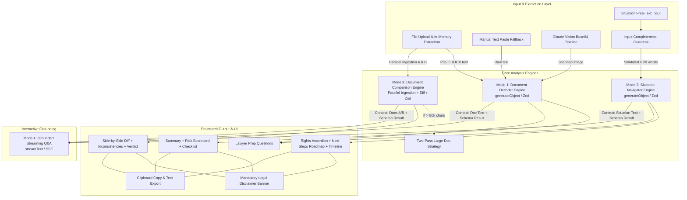

# Feature Research

**Domain:** Legal Information & Document Comprehension Platform (Everyday Citizens & SMBs)  
**Researched:** 2026-09-21  
**Confidence:** HIGH  

---

## Feature Landscape

Legal technology has historically bifurcated between high-priced enterprise contract lifecycle management (CLM) platforms (e.g., Ironclad, SpotDraft, Harvey AI) built for corporate legal teams, and traditional forms/directories (e.g., LegalZoom, Rocket Lawyer) that push boilerplate forms or attorney referrals.

For everyday citizens (tenants, employees, consumers, freelancers) and solopreneurs, existing solutions either overwhelm them with legalese, provide generic ungrounded chat answers, or risk regulatory violations (unauthorized practice of law). 

Gavel bridges this gap across four foundational dimensions: **Document Decoding**, **Situation Navigation**, **Contract Comparison**, and **Contextual Q&A**.

---

### Table Stakes (Users Expect These)

Features users assume exist. Missing these makes the product feel incomplete or untrustworthy.

| Feature | Dimension | Why Expected | Complexity | Notes |
|---------|-----------|--------------|------------|-------|
| **Multi-Format In-Memory File Upload** | Document Decoding / Comparison | Users receive agreements as PDFs, DOCX from employers, or camera phone photos (JPG/PNG). Drag-and-drop file ingestion is standard. | LOW | Next.js API route parsing `multipart/form-data` with `pdf-parse` (PDF), `mammoth` (DOCX), and Claude Vision base64 handling for scanned images. Max 10MB limit. |
| **Document Classification & Party Extraction** | Document Decoding | Users need immediate confirmation that the AI recognized what agreement they uploaded (e.g., "Tenancy Agreement") and the active counterparties. | LOW | Extracted in structured Zod output (`documentType`, `parties: string[]`). |
| **Executive Plain-English Summary** | Document Decoding | Core user intent is "what did I just read?" Users expect an un-jargonized 150–200 word breakdown of core obligations. | MEDIUM | Constrained system prompt requiring 10th-grade reading level, explicitly surfacing who pays what and when termination applies. |
| **Plain-Text Issue Spotting & Intake** | Situation Navigation | When users don't hold a contract (e.g., illegal eviction, withheld deposit, wage theft), they expect a free-text input box to explain what happened in their own words. | LOW | Auto-expanding textarea with clear placeholder examples and category suggestions. |
| **Dispute Categorization** | Situation Navigation | Users expect the system to recognize their legal domain (Tenancy, Employment, Consumer, Family, Property, Financial). | LOW | Categorized via enum in AI schema (`situationType`). Acts as domain framing for legal rights analysis. |
| **Side-by-Side Clause Redlining** | Contract Comparison | When comparing two versions of a contract, users expect to see what changed side-by-side rather than reading two separate summaries. | MEDIUM | Semantic diff table showing `docAVersion` vs `docBVersion` per category (e.g., Liability Cap, Payment Terms). |
| **Contextual Threaded Follow-up (Q&A)** | Contextual Q&A | After receiving an analysis, users immediately have follow-up questions. A static report without interactive clarification feels rigid and dead. | MEDIUM | Next.js route streaming SSE via Vercel AI SDK (`streamText`) hooked to `@ai-sdk/react` (`useChat`), maintaining document text + initial analysis in context. |
| **Universal Prominent Legal Disclaimer** | Core / Compliance | Users and regulators expect strict legal disclaimers stating that the system provides legal information, not legal advice, and does not create an attorney-client relationship. | LOW | Persistent visual banner on every card, header, export, and footer. |
| **Export & Clipboard Sharing** | Core | Users need to copy findings into emails to landlords, employers, or paste into emails to real attorneys. | LOW | Single-click "Copy Full Analysis" and "Download Markdown/Text Report". |

---

### Differentiators (Competitive Advantage)

Features that set Gavel apart from commodity wrappers, generic chatbots, and expensive enterprise tools.

| Feature | Dimension | Value Proposition | Complexity | Notes |
|---------|-----------|-------------------|------------|-------|
| **3-Tier Traffic-Light Risk Scorecard** | Document Decoding | Instead of dense text, users get immediate visual triage: 🔴 High Risk (liability traps, penalty clauses, rights waivers), 🟡 Caution (unusual obligations), 🟢 Standard (routine terms). Dangerous clauses are surfaced first with expandable verbatim excerpts. | MEDIUM | Output via Zod array (`risk: 'high' \| 'medium' \| 'low'`), each containing verbatim `originalText`, `simplified` plain English, and `riskReason`. |
| **Actionable Checklist with Decision Verbs** | Document Decoding | Generic tools stop at summaries. Gavel translates clauses into specific, operational next steps categorized by timing (*Immediate*, *Before Signing*, *After Signing*) and tagged with actionable verbs (*Negotiate*, *Verify*, *Refuse*, *Accept*). | MEDIUM | Directly addresses Problem Statement UC6. Eliminates user paralysis by telling them what action verb applies to which clause. |
| **Targeted Lawyer Preparation Guide** | Document Decoding & Situation Navigation | Legal consultations cost ₹5,000–₹20,000/hr ($200–$600/hr). Gavel extracts 5–8 document-specific or dispute-specific questions referencing exact clauses, saving users thousands in consultation fees. | MEDIUM | Solves Problem Statement UC7. Prevents lawyers from spending billable hours reviewing basic facts. |
| **No-Document Situation Navigation & Rights Mapping** | Situation Navigation | Almost all contract tools fail if the user has no document. Gavel accepts free-text dispute narratives, breaks down statutory rights, flags urgent deadlines, and outputs an actionable timeline. | HIGH | Maps user facts against legal principles. Includes `yourRights`, `warningFlags` (statute of limitations, notice periods), and `estimatedTimeline`. |
| **Pre-Submit Input Completeness Guardrail** | Situation Navigation | Users often submit vague queries (e.g., "my boss fired me"). Rather than burning LLM tokens on hallucinated generalities, client-side heuristic detects inputs < 20 words and prompts for missing facts before API execution. | LOW | Evaluates length and keyword presence on submit. Displays inline guided prompts: "Who was involved? When did this happen? Did you receive a written notice?" |
| **Semantic Favorability Verdict & Negotiation Triaging** | Contract Comparison | Raw diff tools (like Word Track Changes or Diffchecker) show text changes but don't explain *who benefits*. Gavel gives an explicit verdict (`overallFavorability: 'docA' \| 'docB' \| 'neutral'`) and categorizes changes into *Push Back On*, *Accept*, and *Flag for Lawyer*. | HIGH | High cognitive value for solopreneurs negotiating vendor or client contracts without in-house counsel. |
| **Two-Pass Large Document Comparison Engine** | Contract Comparison | Standard LLM context windows degrade when comparing two 40-page contracts simultaneously. Gavel uses a two-pass architecture: Pass 1 extracts key clause summaries per doc; Pass 2 compares the structured clauses. | HIGH | Activates if combined text exceeds 80,000 characters (~20k tokens). Prevents timeout and attention dilution. |
| **Clause-Grounded Streaming Q&A with Strict Non-Prescriptive Guardrails** | Contextual Q&A | Generic AI assistants hallucinate and say "you should sue". Gavel injects the document text and previous structured analysis into every SSE streaming call, strictly enforcing objective informational language ("courts have generally held...", "clause 4 stipulates..."). | MEDIUM | Uses system prompt guardrails forbidding prescriptive "you should" directives; streams with `< 2s` time-to-first-token. |
| **Zero-Persistence Ephemeral Privacy Architecture** | Core / Privacy | Users are terrified of uploading sensitive legal contracts, NDAs, or dispute facts to AI servers. Gavel holds all files strictly in-memory during request execution and retains state only in client React memory. Zero database, zero disk persistence. | LOW | Enormous trust builder for privacy-conscious users and SMBs; eliminates GDPR/DPDP PII data-storage liability. |

---

### Anti-Features (Commonly Requested, Often Problematic)

Features that seem appealing on the surface but introduce severe legal liability, ethical hazards, security vulnerabilities, or operational overhead.

| Feature | Why Requested | Why Problematic | Alternative / Better Approach |
|---------|---------------|-----------------|-------------------------------|
| **Automated Legal Advice Generation ("You should sue", "File this claim")** | Users want definitive, authoritative instructions on whether they will win or what legal strategy to execute. | **Unauthorized Practice of Law (UPL) violation.** In nearly all jurisdictions, only licensed attorneys can provide legal advice. Generates extreme liability; models hallucinate case law; FTC has prosecuted deceptive AI claims (e.g., DoNotPay settlement). | Provide **objective legal information**: Explain what the clauses mean, what general statutory protections exist, what options people commonly pursue, and what exact questions to ask an attorney. |
| **User Accounts, Registration & Cloud Document History** | Users want to save previous contracts and access them across devices or over time. | Requires collecting PII (names, emails, auth tokens), password handling, database security, encrypted cloud storage (S3/PostgreSQL), and compliance with DPDP/GDPR. Creates severe data breach liability for sensitive contracts. | **Zero-Account Ephemeral Sessions.** Keep document processing purely in-memory. Let users immediately download markdown/text reports or copy results to their local clipboard. Zero PII collected. |
| **Server-Side File & Document Persistence** | Users want a document repository or "legal vault" in the cloud. | Retaining confidential contracts (employment agreements, trade secrets, severance agreements) makes the platform a target for discovery subpoenas and data leaks. Increases cloud hosting costs. | Process files strictly in RAM (`Buffer.from(await file.arrayBuffer())`), pass text directly to LLM context, and garbage collect immediately. |
| **Lawyer Referral Directory / Marketplace Network** | Users ask "can you connect me with a lawyer near me?" Seems like an obvious monetization channel. | Complex regulatory compliance around legal fee-splitting and referral fees (Bar Council / ABA rules). High operational overhead vetting lawyers; leads to low-quality "lead-gen" spam that alienates users. | **Lawyer Preparation Guide.** Empower the user to consult any qualified lawyer of their own choosing with a professional, pre-compiled brief and targeted questions. |
| **Automated Legal Document Drafting / Custom Contract Generation** | Users want the AI to draft counter-contracts or generate customized legal notices. | Drafting binding legal instruments requires intimate knowledge of state-specific jurisdictional nuances, local court rules, and precise execution formalities. Defective drafting causes downstream litigation. | Focus exclusively on **document review, comprehension, comparison, and negotiation guidance**. Suggest specific clause-level redline talking points, not full contract authoring. |
| **Live Real-Time Statute Scraping / Court API Integrations** | Seems sophisticated to cite real-time court dockets or scrape state legislative portals. | Government portals are notoriously fragile, lack standardized APIs, and frequently change schemas or introduce CAPTCHAs. Hallucination rate on real-time legal interpretation is high. | Rely on foundational common law principles and pre-encoded statutory frameworks (e.g., Rent Control Acts, Employment Standards, Consumer Protection Acts) in Claude 3.5 Sonnet's knowledge base. |
| **Multi-Language Auto-Translation in V1** | Helpful for non-English speakers dealing with formal legal notices. | Legal terms of art (e.g., "indemnity", "force majeure", "joint and several liability") translate poorly through generic translation layers, creating dangerous false assurances. | Focus on **English-first excellence** for V1. Ensure plain-English output is accessible to 10th-grade reading levels. Add verified multilingual legal models in V2. |

---

## Feature Dependencies

### Dependency Notes

- **Mode 1 (Document Decoder) requires File Ingestion (`F1`):** `pdf-parse` or `mammoth` must convert raw binary buffers to clean text strings before invoking `generateObject`. Scanned image files bypass text extraction and pass directly as base64 images to Claude 3.5 Sonnet Vision.
- **Mode 3 (Document Comparison) requires Parallel Ingestion:** Two files must be uploaded and parsed concurrently (`Promise.all`). Both must pass validation before invoking `/api/analyze/compare`.
- **Two-Pass Comparison enhances Mode 3:** When combined document text exceeds ~80,000 characters (~20,000 tokens), the system must branch into Pass 1 (clause extraction per doc) and Pass 2 (structured comparison) to avoid LLM context dilution.
- **Mode 4 (Interactive Q&A) strictly requires Prior Analysis Context:** The streaming chat route (`/api/chat`) does not run standalone; it takes the original document text or situation description *plus* the structured JSON output of Mode 1, 2, or 3 as foundational grounding in its system prompt.
- **Situation Navigator Guardrail precedes AI execution:** The inline prompt ("Add more detail") runs entirely client-side before any network request is sent to `/api/analyze/situation`.
- **Universal Legal Disclaimer wraps all outputs:** Every output card, modal, clipboard payload, and export file is permanently tagged with the mandatory legal disclaimer.

---

## MVP Definition

### Launch With (v1)

Minimum viable product required to satisfy all 7 problem statement use cases and deliver an end-to-end working experience.

- [x] **In-Memory File Ingestion (`/api/upload`):** Support PDF, DOCX, JPG, PNG up to 10MB; manual text paste fallback; zero disk persistence.
- [x] **Mode 1 — Document Decoder (`/api/analyze/document`):**
  - Executive plain-English summary + parties identified.
  - 3-tier traffic-light Risk Scorecard (🔴 High, 🟡 Caution, 🟢 Standard) with verbatim excerpts.
  - Actionable Checklist with priority tags (*Immediate*, *Before Signing*, *After Signing*) and action tags (*Negotiate*, *Verify*, *Refuse*, *Accept*).
  - Lawyer Prep Questions (5–8 document-grounded questions).
- [x] **Mode 2 — Situation Navigator (`/api/analyze/situation`):**
  - Conversational intake with client-side input validation (< 20 words check).
  - Auto-categorization across 8 dispute types.
  - "Your Rights" plain-language breakdown cards.
  - "Next Steps Roadmap" timeline with urgency tags and "doable without a lawyer" flags.
  - "Documents to Gather" checklist and "When to Call a Lawyer" guidance.
- [x] **Mode 3 — Document Comparison (`/api/analyze/compare`):**
  - Dual upload with custom label inputs (Doc A vs Doc B).
  - Overall favorability verdict badge.
  - Side-by-side differences table with risk levels.
  - Inconsistency alerts (Critical, Notable, Minor) and negotiation triaging.
  - Two-pass extraction handling for documents > 80k characters.
- [x] **Mode 4 — Grounded Contextual Q&A (`/api/chat`):**
  - Streaming SSE endpoint using Vercel AI SDK `streamText` and Anthropic Claude 3.5 Sonnet.
  - Slide-in chat panel passing document text + previous structured analysis.
  - Non-prescriptive legal information system prompt guardrails.
- [x] **Design & Export Experience:** Dark, accessible typography (DM Serif Display, DM Sans, JetBrains Mono, gold accents); one-click clipboard copy; universal legal disclaimer.

### Add After Validation (v1.x)

Features to add once core flows are validated by active hackathon/user feedback.

- [ ] **Formatted PDF Analysis Export:** Allow downloading a styled, clean PDF report (instead of plain text/clipboard) to physically hand to an attorney.
- [ ] **Sample Document Library:** Pre-loaded dummy contracts (standard residential lease, predatory NDA, freelance services agreement) for 1-click evaluation without personal file upload.
- [ ] **Jurisdiction Flag Selector:** Optional dropdown (e.g., India, US, UK) that primes the system prompt with jurisdiction-specific statutory references without requiring live legal DB queries.
- [ ] **Voice-to-Text Situation Dictation:** Allow users experiencing distress to dictate their dispute description via browser Web Speech API.

### Future Consideration (v2+)

Features to defer until product-market fit and legal regulatory frameworks are established.

- [ ] **Multi-Language Legal Localization:** Certified legal translations of plain-English summaries into regional languages (e.g., Hindi, Tamil, Spanish).
- [ ] **Verified Attorney Hand-Off Portal:** Secure, opt-in mechanism to generate a 1-time encrypted link to share the Gavel analysis brief directly with an independent verified attorney.
- [ ] **Playbook Upload for Small Businesses:** Allow solopreneurs/SMBs to upload their standard business negotiation rules (e.g., "never accept net-60 payment", "maximum liability capped at contract value").

---

## Feature Prioritization Matrix

| Feature | Dimension | User Value | Implementation Cost | Priority |
|---------|-----------|------------|---------------------|----------|
| Multi-format File Ingestion & Parsing | Ingestion | HIGH | MEDIUM | **P1** |
| Fallback Manual Text Paste | Ingestion | HIGH | LOW | **P1** |
| Mode 1: Executive Summary & Parties | Document Decoder | HIGH | LOW | **P1** |
| Mode 1: Traffic-Light Risk Scorecard | Document Decoder | HIGH | MEDIUM | **P1** |
| Mode 1: Prioritized Action Checklist | Document Decoder | HIGH | MEDIUM | **P1** |
| Mode 1: Tailored Lawyer Prep Questions | Document Decoder | HIGH | LOW | **P1** |
| Mode 2: Conversational Intake & Validation | Situation Navigator | HIGH | LOW | **P1** |
| Mode 2: Your Rights Accordion & Next Steps | Situation Navigator | HIGH | MEDIUM | **P1** |
| Mode 2: Evidence Checklist & Urgency Flags | Situation Navigator | HIGH | MEDIUM | **P1** |
| Mode 3: Dual Upload & Favorability Verdict | Contract Comparison | HIGH | MEDIUM | **P1** |
| Mode 3: Side-by-Side Differences Table | Contract Comparison | HIGH | HIGH | **P1** |
| Mode 3: Inconsistencies & Negotiation Guide | Contract Comparison | HIGH | MEDIUM | **P1** |
| Mode 4: Streaming Grounded Q&A Chat | Contextual Q&A | HIGH | MEDIUM | **P1** |
| Universal Legal Disclaimer Compliance | Compliance | HIGH | LOW | **P1** |
| Clipboard & Text Export Tools | Core UX | MEDIUM | LOW | **P1** |
| Two-Pass Large Document Engine | Comparison | MEDIUM | HIGH | **P2** |
| Sample Document Playground | Onboarding | MEDIUM | LOW | **P2** |
| Styled PDF Report Generation | Export | MEDIUM | MEDIUM | **P2** |
| Voice Dictation Input | Situation Navigator | LOW | MEDIUM | **P3** |
| Jurisdiction Switcher Dropdown | Configuration | MEDIUM | MEDIUM | **P3** |
| Multi-language Output | Localization | HIGH | HIGH | **P3** |

**Priority Key:**
- **P1 (Must have for launch):** Non-negotiable core functionality satisfying all 7 Problem Statement use cases.
- **P2 (Should have, add when possible):** Resilience and onboarding enhancements (two-pass processing, sample library).
- **P3 (Nice to have, future consideration):** High-cost or regulatory-heavy extensions.

---

## Competitor Feature Analysis

| Feature Dimension | Generic Consumer AI (ChatGPT / Claude web) | Enterprise CLM (SpotDraft, Ironclad, Robin AI) | Legal Self-Help Sites (LegalZoom, Rocket Lawyer) | Gavel Approach |
|---|---|---|---|---|
| **Document Ingestion** | Raw upload without legal parsing logic or validation. | Enterprise integrations (Salesforce, Google Drive, DocuSign, Word). | Form wizards; requires creating account before uploading. | **In-memory multi-format drag-and-drop** (PDF, DOCX, JPG/PNG via Vision) with immediate fallback paste. Zero account required. |
| **Risk Assessment** | Generic text prose; no standardized risk scale or clause-level triage. | Custom enterprise playbook scoring against company standards. | None; relies on selling document templates. | **3-Tier Traffic Light Scorecard** (🔴🟡🟢) surfacing dangerous clauses first with plain English + verbatim text. |
| **No-Document Situations** | Freeform chatbot response without structured action roadmap. | Unsupported; requires contract document files. | Static FAQ articles and high-cost "talk to an attorney" funnels. | **Situation Navigator:** Structured breakdown of statutory rights, urgency timeline, evidence to gather, and lawyer prep. |
| **Document Comparison** | Character/word diffing or generic comparative summaries. | Complex multi-page redline workflows inside Microsoft Word plugins. | Not supported. | **Semantic Favorability Verdict & Negotiation Guide:** Plain-English determination of who benefits, plus push-back triaging. |
| **Actionable Next Steps** | Suggests "talk to a lawyer" repeatedly without concrete immediate actions. | Task assignment for internal corporate legal counsels. | Upsells attorney consultation subscriptions. | **Actionable Checklist** with concrete verbs (*Negotiate*, *Verify*, *Refuse*, *Accept*) and urgency categories (*Immediate*, *Before Signing*). |
| **Q&A Interactivity** | Generic chat prone to prescriptive "you should" advice and legal hallucinations. | Internal enterprise copilots querying internal legal repositories. | Asynchronous paid messaging with partner lawyers. | **Grounded Streaming Q&A** locked to document text + structured analysis; non-prescriptive informational guardrails. |
| **Privacy & Data Retention** | Retains chat history; default opt-in to model training unless opted out. | SOC 2 Type II, cloud repository with persistent tenant data. | Retains documents and credit card data indefinitely. | **Zero Persistence & Zero PII:** Files processed purely in memory, state stored only in browser RAM. |

---

## Sources

- **Gavel Source Specifications:** [gavel-prd-frd.html](file:///home/zeph/Code/gavel/gavel-prd-frd.html) and [.planning/PROJECT.md](file:///home/zeph/Code/gavel/.planning/PROJECT.md)
- **Legal Technology & Contract Review Ecosystem Benchmarks:** SpotDraft, Ironclad, Robin AI, and Harvey AI feature breakdowns.
- **Consumer Legal Self-Help Case Studies:** FTC v. DoNotPay regulatory settlement (2024–2025) on unauthorized practice of law (UPL) and AI claim boundaries.
- **AI Tooling Frameworks:** Vercel AI SDK 3.x (`generateObject`, `streamText`, `useChat`) and Anthropic Claude 3.5 Sonnet specifications.

---
*Feature research for: Legal Information & Document Comprehension Platform (Gavel)*  
*Researched: 2026-09-21*
